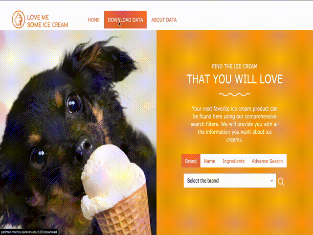

# IceCream-Explorer

## Introduction
A website that allows users to search for ice cream products info from a large database. This is a team project for the _Software Design_ course at Carleton College, co-authored with Peter Tu @tutingjun and Yucheng Yang @YuchengY (we were all new to full-stack web development!). The data is retrieved from [**Kaggle**](https://www.kaggle.com/tysonpo/ice-cream-dataset) and managed using PostgreSQL. 

**Built with:**
- front-end: HTML, CSS, JavaScript 
- back-end: Flask, Psycopg2 (PostgreSQL database adapter)

## Requirement 
Currently, this website can only be run on a local server. During development, we ran the program on the Perlman server at Carleton College, which has the following requirements already installed. 

- Python3 (last run with Python 3.6.8)
- [**psycopg2**](https://pypi.org/project/psycopg2/) (last run with psycopg 2.7.3)
- Flask (last run with Flask 0.12.2)

## How to Run the Program 
On the Perlman server:
1. Connect to the Carleton VPN.
2. In the command line, type `ssh user@perlman.mathcs.carleton.edu`, where `user` should be replaced with your Carleton username.
3. After cloning this repository onto the Perlman server, navigate to the main folder. 
4. In the command line, type `python3 webapp.py perlman.mathcs.carleton.edu <port number>`, where `<port number>` can be 5107 or 5207.
5. In your web browser, go to `http://perlman.mathcs.carleton.edu:<port bumber>`, where `<port number>` is the port number you entered in the previous step.

On localhost:
1. After cloning this repository onto your local machine, navigate to the main folder. 
3. In the command line, type `python3 webapp.py 127.0.0.1 <port number>`, where `<port number>` can be 5107 or 5207.
4. In your web browser, go to `http://127.0.0.1:<port bumber>`, where `<port number>` is the port number you entered in the previous step.

## What It Does
Search for ice cream products by brand name, product name, ingredient, as well as many other filters (in the advance search section):

Rank products in search result:

Click on products on the list to view details:

Downloading the dataset and viewing metadata info: 

## Known Issues
If you use the browser back button when returning from product_list(product_list.html) to home page(index.html), and then hit the search button on the home page again, all products will be returned (the search filter will not work even though the conditions put in before will be there). In short: don't hit the browser back button when you are at the product_list(product_list.html) page. Click on the home page icon to go back to the home page when you want to initiate a new search.
